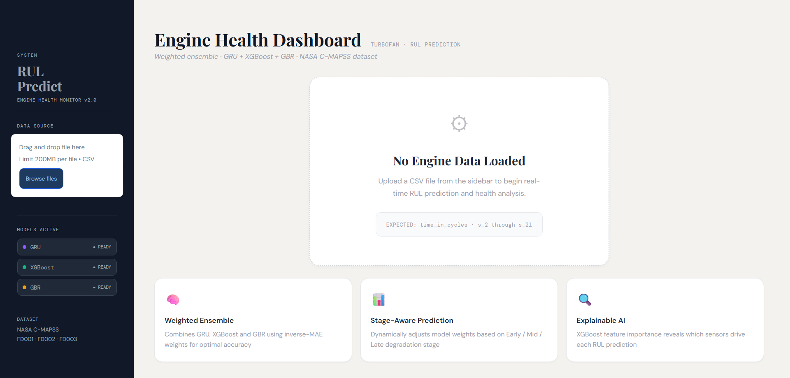
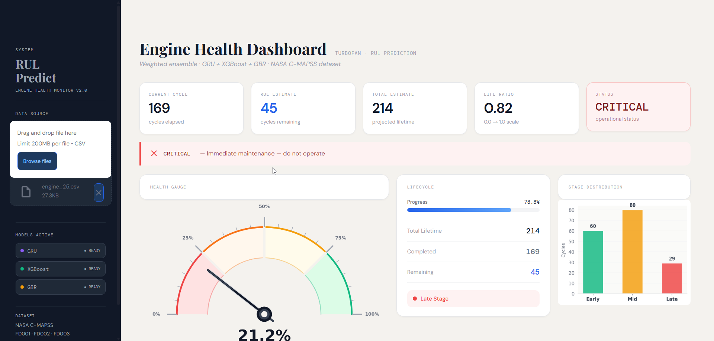
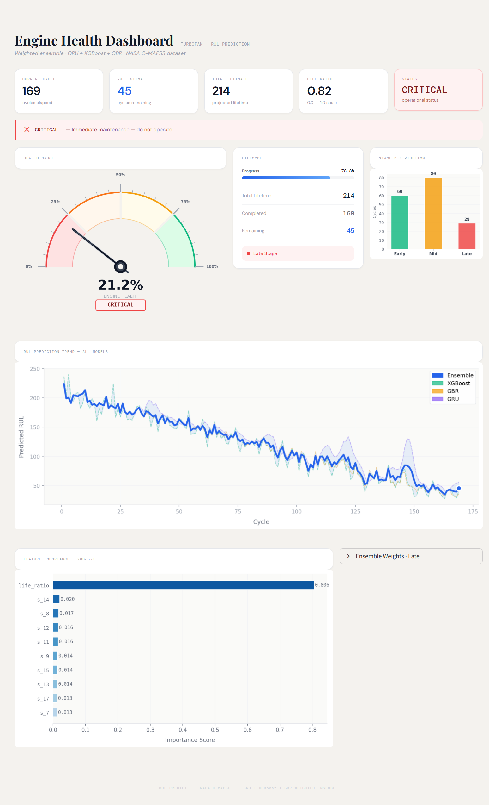

# ⚙️ Engine Remaining Useful Life (RUL) Prediction Dashboard


> ⚠️ **Research Preview**
> This repository contains the dashboard interface only.
> Full methodology, training pipeline, and model weights are part of an ongoing research submission and are not publicly available at this time.

---

## 📌 Overview

An interactive health monitoring dashboard for predicting the **Remaining Useful Life (RUL)** of turbofan engines, built on the **NASA C-MAPSS** benchmark dataset.

The system uses a proprietary ensemble approach combining multiple model architectures with a stage-aware weighting strategy.

---

## 📸 Dashboard Preview

### Health Gauge & Status Cards


### RUL Prediction Trend


### Sensor Analysis


---

## 🚀 Key Capabilities

- Real-time RUL prediction from engine sensor CSV
- Multi-model ensemble (details withheld pending publication)
- Stage-aware degradation classification — Early / Mid / Late
- Safety status indication — SAFE / MONITOR / CAUTION / CRITICAL
- Engine health gauge visualization
- Sensor feature importance analysis

---

## 📁 Dataset

**NASA C-MAPSS** — Commercial Modular Aero-Propulsion System Simulation

> Dataset not included. Available at the
> [NASA Prognostics Data Repository](https://www.nasa.gov/content/prognostics-center-of-excellence-data-set-repository).

---

## ▶️ Usage

> Note: Requires trained model files which are not included in this repository.
```bash
pip install -r requirements.txt
streamlit run app.py
```

Upload any compatible engine sensor CSV via the sidebar to begin analysis.

---

## 📬 Contact

**Jay Muramalla**
For research inquiries or collaboration, please reach out via GitHub.

---

*Full paper and implementation details will be made available upon publication.*